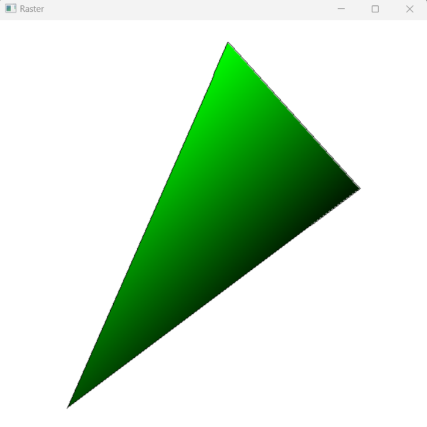

# Computer Graphics from scratch


This the C implements practices for the book [Computer graphics from scratch](https://gabrielgambetta.com/computer-graphics-from-scratch/). Only avaliable on Windows now.

<p align="center">
  
</p>

<p align="center">
  
</p>

<p align="center">
  
</p>

## How to build.
### Install dependances.
- [Clang](https://github.com/llvm/llvm-project)
- [Make](https://gnuwin32.sourceforge.net/packages/make.htm)

### Build.

#### Build All

```
.\build.bat
```

#### Ray Tracer.

```
make -f "Makefile.raytracer" all
```

#### Raster Triangle.

```
make -f "Makefile.raster_triangle" all
```

#### Raster Perspective.

```
make -f "Makefile.raster_perspective" all
```

#### Raster Textures.

```
make -f "Makefile.raster_textures" all
```

